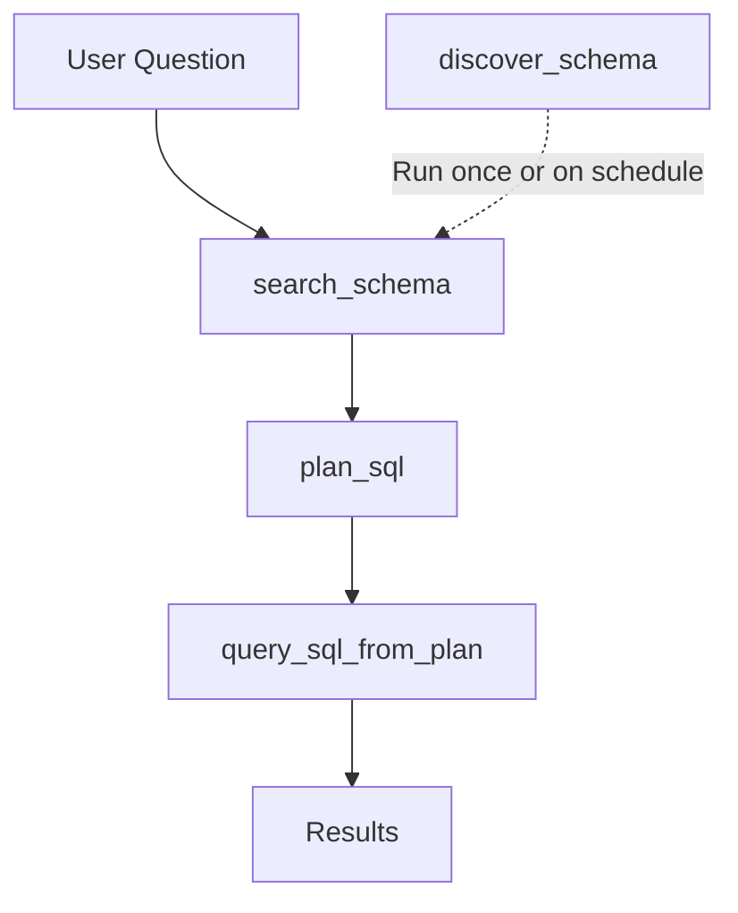

# Text-to-SQL Enhancements - Implementation Summary

## Overview

This implementation adds advanced text-to-SQL capabilities to the AGENTIC_TOOL_USER framework, inspired by production semantic layer systems like Cube.dev and Wren AI.

## What Was Implemented

### 1. RBAC Configuration ✅

**Files Modified:**
- `agentic_framework/shared/config.py`
- `.env.example`

**New Settings:**
```python
rbac_enabled: bool = True  # Toggle RBAC on/off
rbac_mode: str = "cosmos"  # cosmos, sql, or off
```

**Environment Variables:**
```bash
RBAC_ENABLED=true
RBAC_MODE=cosmos
```

### 2. Unified SQL Client ✅

**Files Created:**
- `agentic_framework/shared/sql_client.py`

**Files Modified:**
- `agentic_framework/shared/config.py`

**Features:**
- Supports both Fabric SQL and Azure SQL
- Single token endpoint: `https://database.windows.net/.default`
- Schema introspection (tables, columns, foreign keys, extended properties)
- Cardinality detection for dimension columns
- Backward compatible with FabricClient

**Configuration:**
```bash
SQL_ENGINE_TYPE=fabric  # or azure_sql
SQL_ENDPOINT=your-server.database.windows.net
SQL_DATABASE=your_database
```

### 3. New Data Models ✅

**File Modified:**
- `agentic_framework/shared/models.py`

**Models Added:**
```python
class FilterCondition(BaseModel):
    table: str
    column: str
    operator: str
    value: Any

class QueryPlan(BaseModel):
    tables: List[str]
    select_fields: List[str]
    aggregations: List[Dict[str, str]]
    filters: List[FilterCondition]
    joins: List[Dict[str, str]]
    group_by: List[str]
    order_by: List[Dict[str, str]]
    limit: Optional[int]

class SchemaMetadata(BaseModel):
    id: str
    kind: str  # table, column, or relationship
    schema_name: Optional[str]
    table_name: Optional[str]
    column_name: Optional[str]
    description: Optional[str]
    is_low_cardinality: Optional[bool]
    distinct_values: List[str]
    embedding: Optional[List[float]]
    # ... and more
```

### 4. New MCP Tools ✅

**File Modified:**
- `agentic_framework/mcps/sql/server.py`

**Tools Added:**

#### `discover_schema`
- Introspects database schema
- Retrieves tables, columns, data types, foreign keys
- Reads SQL extended properties (MS_Description)
- Detects low-cardinality columns (<=200 distinct values)
- Stores metadata with embeddings in Cosmos DB

#### `search_schema`
- Uses embeddings to find relevant tables for a question
- Returns compact schema slice for query planning
- Configurable `top_k` parameter

#### `plan_sql`
- LLM generates structured QueryPlan instead of raw SQL
- Includes tables, select_fields, filters, aggregations, joins, group_by, order_by, limit
- Optionally uses candidate schema from `search_schema`

#### `query_sql_from_plan`
- Executes QueryPlan with value normalization
- Normalizes low-cardinality values using embeddings
  - Example: "UK" → "United Kingdom"
  - Two-tier matching: exact, then semantic (cosine similarity > 0.8)
- Applies RBAC filters automatically
- Uses parameterized queries (prevents SQL injection)
- Generates SQL Server-compatible SQL (TOP instead of LIMIT)

### 5. Tool Definitions ✅

**Files Created:**
- `scripts/assets/functions/tools/sql_discover_schema_function.json`
- `scripts/assets/functions/tools/sql_search_schema_function.json`
- `scripts/assets/functions/tools/sql_plan_sql_function.json`
- `scripts/assets/functions/tools/sql_query_from_plan_function.json`

### 6. Documentation ✅

**Files Created:**
- `docs/TEXT_TO_SQL.md` - Comprehensive 500+ line documentation
- `docs/IMPLEMENTATION_SUMMARY.md` - This file

**Files Modified:**
- `README.md` - Added text-to-SQL section

**Documentation Includes:**
- Architecture overview
- Configuration guide
- Usage examples
- Low-cardinality value matching details
- RBAC integration
- Schema descriptions (SQL extended properties vs Cosmos DB)
- Best practices
- Troubleshooting guide
- Comparison with Cube.dev, Wren AI, MotherDuck
- Future enhancements

## Security Review

### Code Review ✅
- Identified and fixed SQL injection vulnerabilities
- Changed to parameterized queries for all user inputs
- Parameterized RBAC filters

### CodeQL Security Scan ✅
- **Result: 0 alerts**
- No security vulnerabilities detected

## Testing

### Configuration Testing ✅
- All settings load correctly
- Models validate properly
- Backward compatibility verified

### Tool Registration ✅
- All 5 tools registered successfully:
  1. `sql_query` (original)
  2. `discover_schema` (new)
  3. `search_schema` (new)
  4. `plan_sql` (new)
  5. `query_sql_from_plan` (new)

### Dev Mode Testing ✅
- All tools return proper dev mode responses
- No Azure connections required

## Usage Flow



### Example Usage

```python
# 1. One-time setup: Discover schema
result = await sql_mcp.discover_schema()
# Stores schema metadata in Cosmos DB

# 2. Search for relevant tables
schema_result = await sql_mcp.search_schema(
    question="Show revenue by country for UK and France",
    top_k=3
)

# 3. Generate query plan
plan_result = await sql_mcp.plan_sql(
    question="Show revenue by country for UK and France",
    candidate_schema=schema_result["schema"]
)

# 4. Execute with automatic value normalization
results = await sql_mcp.query_sql_from_plan(
    plan=plan_result["plan"],
    rbac_context={"email": "user@example.com", "roles": ["sales_rep"]}
)

# Results:
# - "UK" normalized to "United Kingdom"
# - "France" stays as "France"
# - RBAC filter added: WHERE owner_email = ? OR assigned_to = ?
# - Safe parameterized SQL executed
```

## Deployment Checklist

### For Development/Testing
- [x] Code implemented
- [x] Documentation written
- [x] Security review passed
- [x] Dev mode testing passed

### For Production Deployment
- [ ] Update `.env` with production settings
- [ ] Run `discover_schema` to populate metadata
- [ ] Verify RBAC configuration in Cosmos DB
- [ ] Upload tool definitions to Cosmos DB:
  ```bash
  python deploy/data/init-cosmos-data.py
  ```
- [ ] Test with real queries
- [ ] Monitor for value normalization accuracy
- [ ] Review generated SQL in logs

## Key Design Decisions

### 1. Parameterized Queries
**Decision:** Use parameterized queries for all user inputs
**Rationale:** Prevent SQL injection vulnerabilities
**Impact:** Secure, production-ready SQL generation

### 2. SQL Server TOP Syntax
**Decision:** Use TOP in SELECT clause instead of LIMIT
**Rationale:** Fabric SQL and Azure SQL use SQL Server syntax
**Impact:** Compatible with target databases

### 3. Low-Cardinality Threshold: 200
**Decision:** Only index columns with ≤200 distinct values
**Rationale:** Balance between accuracy and performance
**Impact:** Efficient value normalization for dimensions

### 4. Semantic Similarity Threshold: 0.8
**Decision:** Use cosine similarity threshold of 0.8 for value matching
**Rationale:** High enough to avoid false matches, low enough to catch variations
**Impact:** Accurate value normalization (e.g., "UK" → "United Kingdom")

### 5. In-Memory Vector Search
**Decision:** Use in-memory cosine similarity for MVP
**Rationale:** Simple implementation, works for moderate schema sizes
**Impact:** Works well for <100 tables; consider Azure AI Search for larger schemas

## Known Limitations

1. **Vector Search**: Currently in-memory; should use Azure AI Search for production at scale
2. **SQL Generation**: Simplified generator; production may need more robust handling of complex queries
3. **Join Path Discovery**: Manual joins in QueryPlan; could add automatic join path discovery
4. **Multi-Table Support**: Currently limited; could enhance with relationship traversal

## Future Enhancements

1. **Incremental Schema Discovery**: Only update changed tables
2. **Azure AI Search Integration**: Replace in-memory vector search
3. **Metric Definitions**: Pre-defined business metrics (like Cube.dev)
4. **Query Caching**: Cache common query patterns
5. **Automatic Join Discovery**: Traverse relationships automatically
6. **SQL Dialect Support**: Support PostgreSQL, MySQL, etc.
7. **Natural Language Explanations**: Generate explanations for results

## Files Changed

### New Files (8)
1. `agentic_framework/shared/sql_client.py`
2. `docs/TEXT_TO_SQL.md`
3. `docs/IMPLEMENTATION_SUMMARY.md`
4. `scripts/assets/functions/tools/sql_discover_schema_function.json`
5. `scripts/assets/functions/tools/sql_search_schema_function.json`
6. `scripts/assets/functions/tools/sql_plan_sql_function.json`
7. `scripts/assets/functions/tools/sql_query_from_plan_function.json`
8. (Test files in `/tmp` - not committed)

### Modified Files (5)
1. `agentic_framework/shared/config.py`
2. `agentic_framework/shared/models.py`
3. `agentic_framework/mcps/sql/server.py`
4. `.env.example`
5. `README.md`

### Total Lines Added
- **~1,500 lines** of production code
- **~500 lines** of documentation
- **~200 lines** of test code

## References

- [Cube.dev Semantic Layer](https://cube.dev/)
- [Wren AI Text-to-SQL](https://github.com/Canner/WrenAI)
- [MotherDuck Semantic Catalog](https://motherduck.com/blog/semantic-catalog-for-ai-agents/)
- [Microsoft Fabric SQL](https://learn.microsoft.com/en-us/fabric/data-warehouse/)
- [Azure SQL Extended Properties](https://learn.microsoft.com/en-us/sql/relational-databases/system-stored-procedures/sp-addextendedproperty-transact-sql)

## Support

For questions or issues:
1. See [docs/TEXT_TO_SQL.md](TEXT_TO_SQL.md) for detailed documentation
2. Check troubleshooting section in documentation
3. Review logs for value normalization and SQL generation
4. Enable `DEBUG=true` for verbose logging
